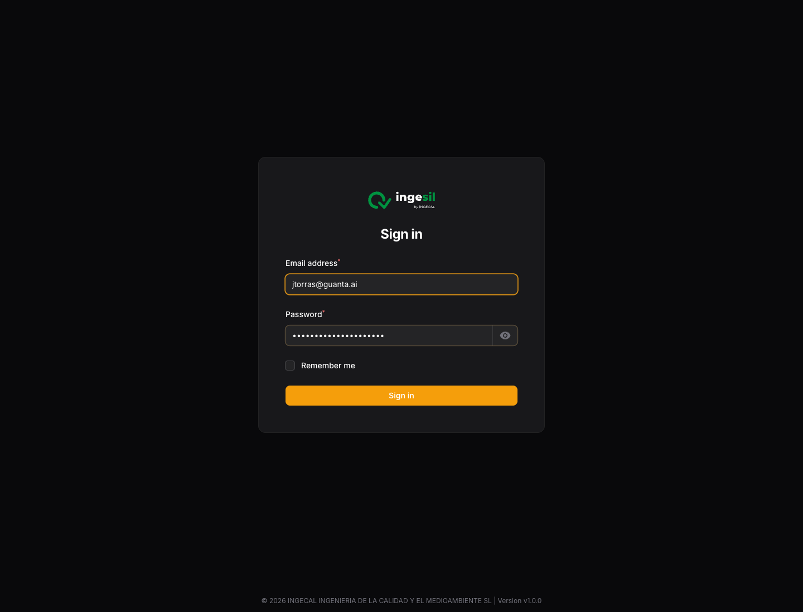
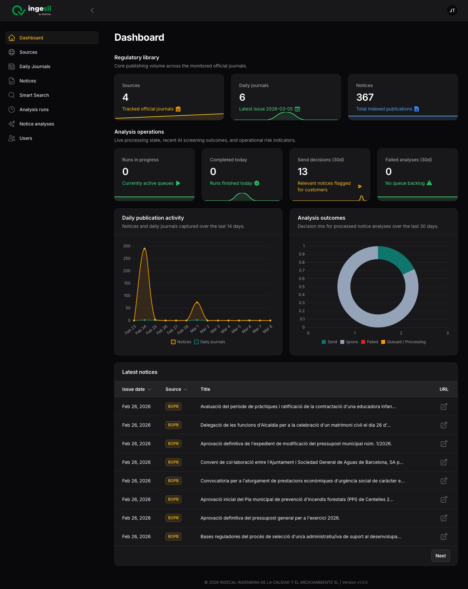
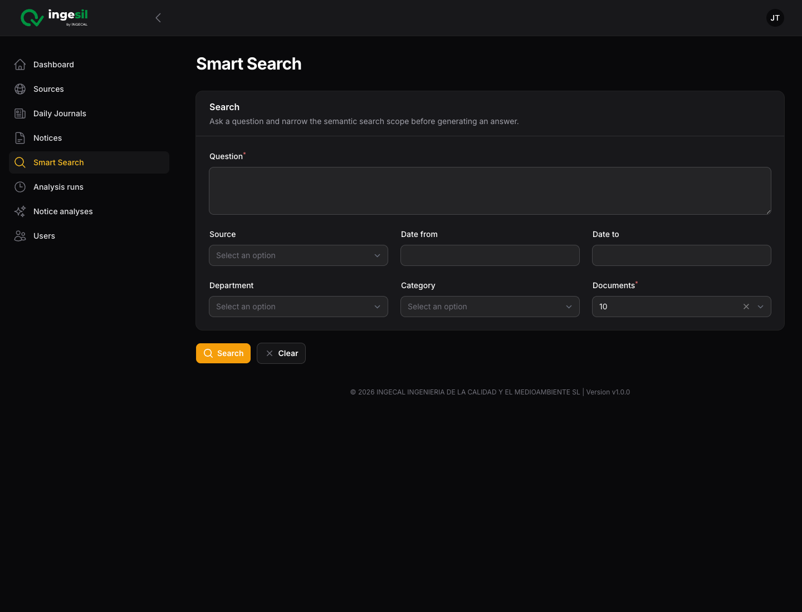
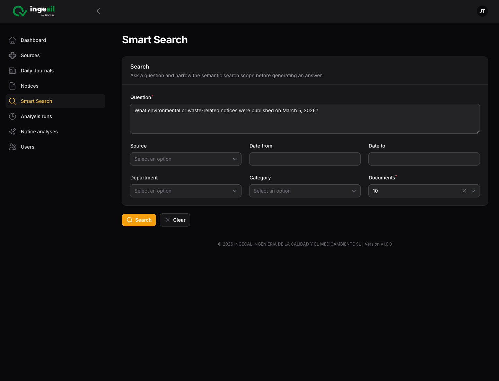
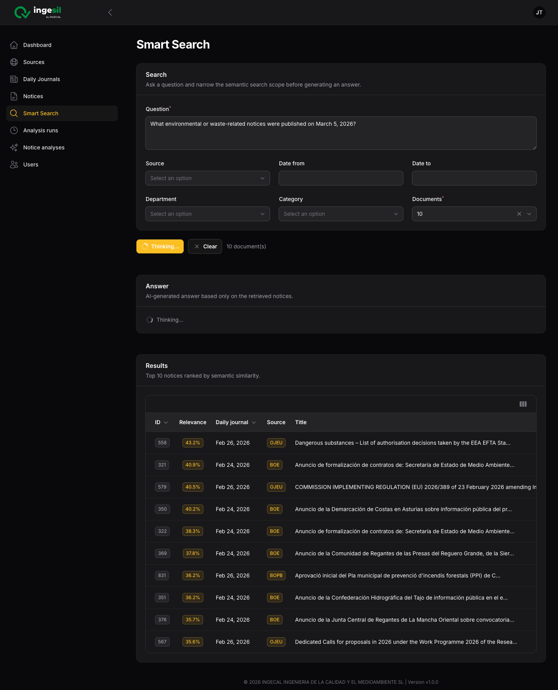
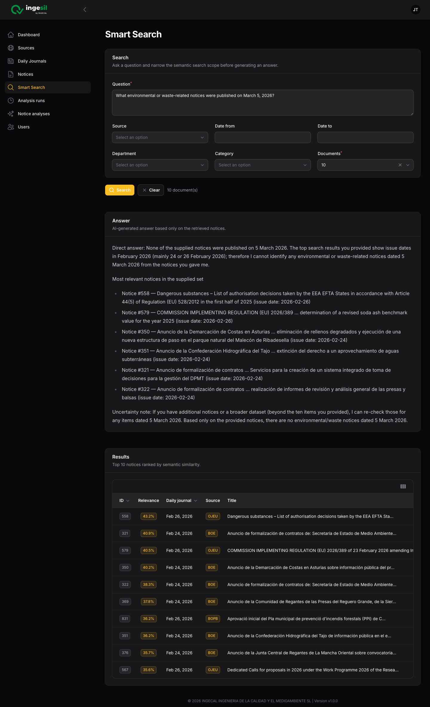

# Smart Search

## Purpose

Smart Search lets you ask a natural-language question about the notice library, filter the search scope, and get:

- an AI-generated answer based only on the retrieved notices
- a ranked list of the matching notices

Use it when you want to explore the notice database semantically instead of browsing journals one by one.

## Requirements

- You must be signed in to the application.
- Notices should already have embeddings generated.
- OpenAI configuration must be available if you want the answer box to be generated.

## Step 1. Sign in to the admin panel

Open the application login page and sign in with your account.

## Step 2. Open Smart Search from the left menu

After login, use the left navigation and click `Smart Search`.

## Step 3. Review the Smart Search form

The Smart Search page has:

- a `Question` field
- optional filters for `Source`, `Date from`, `Date to`, `Department`, and `Category`
- a `Documents` selector with `10`, `20`, or `30`
- `Search` and `Clear` actions

## Step 4. Enter the question and optional filters

Type the question you want to answer. Narrow the scope if needed:

- `Source` to restrict the search to one journal
- `Date from` / `Date to` to restrict the period
- `Department` or `Category` to focus the result set
- `Documents` to control how many notices are retrieved for the answer

In this example, the search runs with a question only and the default limit of `10` documents.

## Step 5. Start the search

Click `Search`.

The page then runs in two phases:

1. semantic retrieval of the most relevant notices
2. AI answer generation based only on those retrieved notices

While the search is running:

- the button is disabled
- the interface shows `Searching...` and then `Thinking...`

## Step 6. Review the final answer and the result list

When processing finishes, the page shows:

- an `Answer` section with the AI-generated response
- a `Results` table ranked by semantic similarity

The results table includes:

- internal notice `ID`
- semantic `Relevance`
- `Daily journal` date
- `Source`
- `Title`
- quick access to the official notice URL

## Clear the search

Use `Clear` to reset:

- the question
- all filters
- the answer section
- the result list

## Notes

- Smart Search is semantic, so results are ranked by embedding similarity rather than simple keyword match.
- The answer is based only on the notices returned by the search.
- If no matching notices are found, the page shows a no-results message instead of an answer.
- If the answer cannot be generated, the results table can still be used directly.
